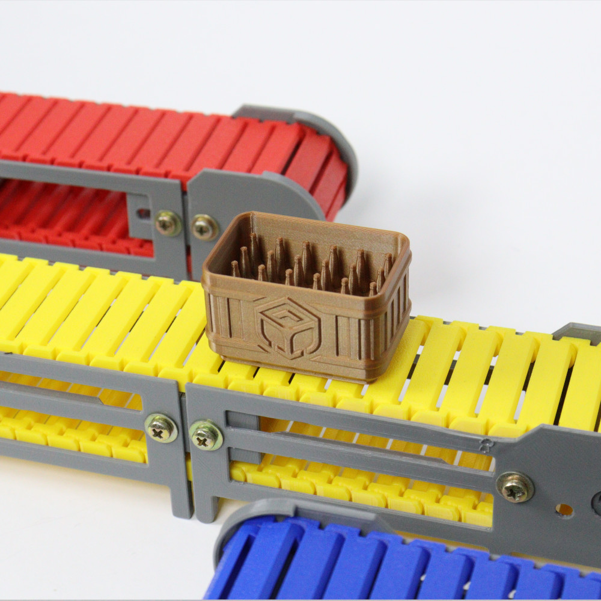

# Convoyeur Industriel Modulaire

rocket: donne 
sparkles: donne

## synopsis
Ce projet est un projet de Convoyeur Industriel Modulaire qui sélectionne les objets en fonction de leur poid.

## description
Voici le lien pour accéder au fichier STL
[Projet original](https://cults3d.com/en/3d-model/various/conveyor-belts-simufab-3dtroop)
## construction

## Product backlog

- [x] Créer le dépôt GitHub
- [ ] Rédiger la documentation
